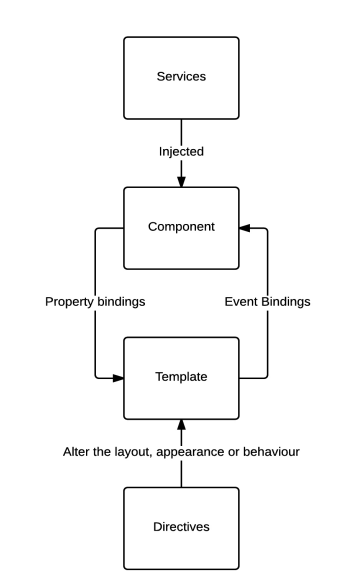

# Architectural overview

At this stage we will dive into the main blocks that construct an Angular application such as:

- Component
- Service
- Directive
- Pipes
- Template

It a plus if you have some experience with Angular -- which probably is true -- and you are willing to apply good practices and design patterns. That can not be reached without a clear understanding of these main blocks mentioned above.

A quick recap for the general architecture of Angular won't hurt. It will reflesh your memory and make sure you've a solid architectual basis to build a pattern upon.

The figure bellow shows how the main building blocks interact with each other:



## Component

Component represent the views of an Angular application. They are responsible for what, when and how the user-interface element they describe should be displayed on the client screen.
A component is a simple class that defines the logic required which based on it, the view will be built.

## Template

In angular, there's a separation between the logic and the HTML which it manipulate, unlike React.
The HTML code related to a component is known as the template.
The relation between a component and a template is indicated by using metadata.
The metadata is some sort of a decoration pattern that tells Angular how to interpret and process the related component class.

```typescript
@Component({
  selector: "my-component", // the component tag
  templateUrl: "./my-component.html", // the template path
})
export class MyComponent {
  constructor() {}
}
```

## Services

At this cornerstone, we've reviewed half of the main blocks of each Angular application. Now we address the Serices. A service in Angular is a class with a unique purpose. Its role is to provide a well-defined service to other parts of the application.

You need to understand that a component shall only be responsible of the user experience, no more. Anything else must be gelegated to services.

How to use a service in a component?

It's simple! You need to use dependency injection. Dependency injection is the process which a requesting -- at this context is a component -- gets a fully formed instance of a requested class dynamically (service class).

There's two ways to use dependency injection with Angular. You either need to define a provider for the Service class, in "app.module.ts".

```typescript
import { SampleService } from "./path/to/service";

bootstrap(SampleComponent, [SampleService]);
```

Or alternatively, by defining a provider in the component annotations.

```typescript
import { SampleService } from "./path/to/service";

@Component ({
    // other fields...
    providers: [SampleService]
})
// SampleComponent class
```

What is the difference between the two approaches?

If you apply the first approach, then the same instance of the service will be served across every class that request it.
However the second approach, an instance will be served to the component each time the component is instantiated.

Which one is the optimal option?

Well, it depends on what you your components and services are meant to do.
Some services are meant to be used everywhere, others are specific to a particular part of the application.

An important point to note is that you need to pass the service as an argument in the component constructor.

```typescript
constructor (private sampleService: SampleService) {
    // your logic here...
}
```
