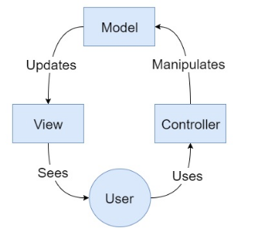
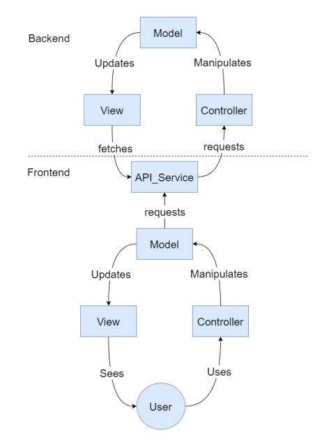

# Navigational patterns

This section is dedicated to explore one of the most useful navigational object-oriented patterns and clearify how to apply them in the Angular way.

Navigational patterns are essentially implemented under the purpose of organizing events that related to the navigation of the users of the application.

Angular by default forces you to to do the most of your work in a certain way, which is the object-oriented approach. This means by using all the previous mentioned parts (components, services, pipes, etc...).

By forcing the developer to implement these building blocks upon the building of the application ensure a good architecture. This is too close to the way other famous framework approach like the Zend framework for PHP, or Ruby on Rails for Ruby.

Framework that forces a certain way of building application are here to make the life of the developer easier and boost the speed of the development phase.

Let's be honest, Angular way of designing things is way above average. This can be both a negative and a positive point depending on the side you take.

During this section, we will expore the following patterns:

- Model-view-controller
- Redux

## MVC

The whole principle behind the famous model-view-controller design pattern is relatively simple.

As showing in the diagram below, the MVC design pattern is composed of three blocks: Model, View, and Controller:

### overview

the main component are:

- _The Model_ which stores the data required by the application according to commands sent by the Controller.
- _The Controller_ receives actions from the user and directs model updates accordingly. It can also change the view at any given moment.
- _The View_ is generated and updated everytime the model changes.

> I told you, it's too simple.

### Model-View-Controller limitations (scope: frontend)

It is a good question to ask why that widely used pattern comes to frontend with the help of frameworks such Angular.

The answer to this question isn't that complicated. First, if you are building your application with Angular which provides a service, changes that you have a backend are high. Then, if that backend uses also the model-view-controller design pattern, You will end up with the following hierarchy:

The diagram shows an implemntation on top of another MVC implemntation. The communication between these two layers are maintained by an API service that sends requests to the backend controller and parses the resultant view.

A big part of the developers community think that these many layers and the fact that the architecture is kind of duplicated on the frontend and the the backend is not a good practice. However, the fact that it brings maintainability through a well-defined separation-of-concerns.

The dual model-view-controller is not the only concern. Another problem we must talk about is the frontend models will not be pure models as they must account for variables regarding the UI itself. Hence, your frontend models tend to become hideous blobs of code where UI variables rub shoulders with the actual representation of your user.

Knowing these problems is important. So you can avoid them and harness the advantages of the MVC design pattern.
