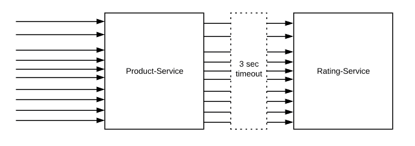

# Stability Patterns

Here, we put the light on one of the cornerstones of software engineering. The only rule here, is that you must expect the worst from your environment and your users and be prepared for it.

In this chapter, we will cover about stability patterns and anti-patterns, such as the following list:

- Timeouts
- Circuit breaker
- Factory
- Memento
- The prototype and reusable pool

## Timeouts

The timeout pattern is pretty straightforward and many HTTP clients have a default timeout configuration.

The main goal of this pattern is to avoid unbounded waiting times for responses and thus treating every request failed where no response was received withing the timeout.

Timeouts patterns are widely implemented in almost every application to avoid requests getting stuck forever. However, dealing with timeouts is not trival.

Here is an example of the where this design pattern take a place.

